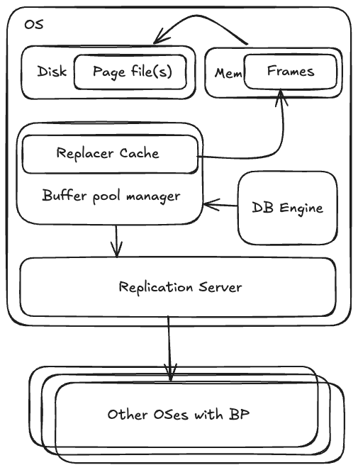

# Composter

distributed buffer pool manager

### Components

- Pages (on disk)
- Frames (in memory)
- Disk Manager
    - Write and read from disk
- Disk Scheduler
    - Flush data from memory to disk
    - read data from disk in to memory
    - IO scheduler for the disk manager
- Page Replacer
    - CLOCK-sweep algorithm
    - Used to decide if pages should be evicted from the buffer pool
    - Bring in new pages if old ones can be evicted
- Buffer Manager
    - hashmap for storing page -> frame mappings in memory
    - create pages from on disk format
        - pages are configurable but will default to 4kb
    - nested objects
        - page replacer
        - disk scheduler

TODO(?) 
- Replication server
    - naive RAFT implementation

### Diagram

